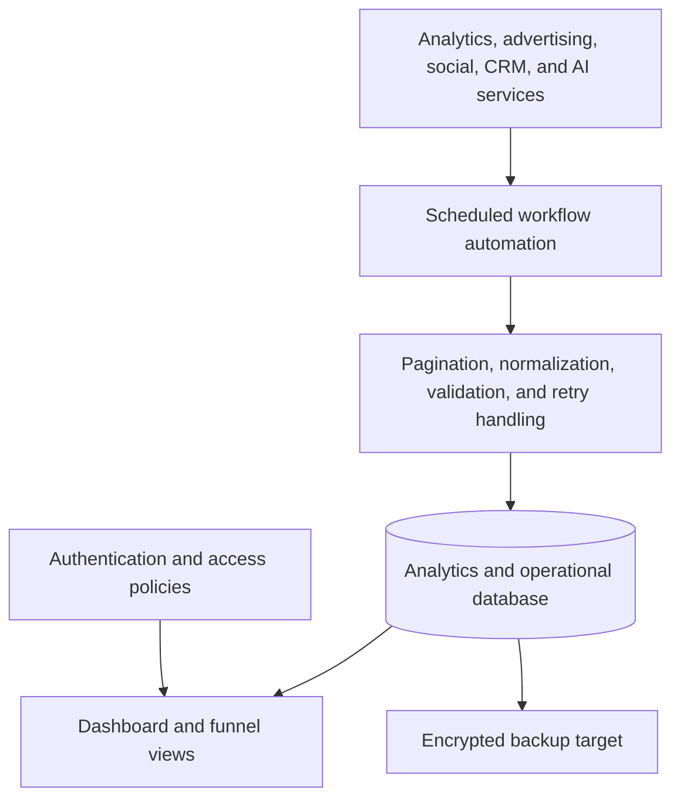

# Sanitized architecture overview

```mermaid
flowchart TB
  SOURCES[Analytics, advertising, social, CRM, and AI services]
  WORKFLOWS[Scheduled workflow automation]
  NORMALIZE[Pagination, normalization, validation, and retry handling]
  DB[(Analytics and operational database)]
  AUTH[Authentication and access policies]
  DASH[Dashboard and funnel views]
  BACKUP[Encrypted backup target]

  SOURCES --> WORKFLOWS
  WORKFLOWS --> NORMALIZE
  NORMALIZE --> DB
  AUTH --> DASH
  DB --> DASH
  DB --> BACKUP
```

All source-specific accounts, IDs, domains, schemas, and credentials are placeholders or have been removed from the public copy.
